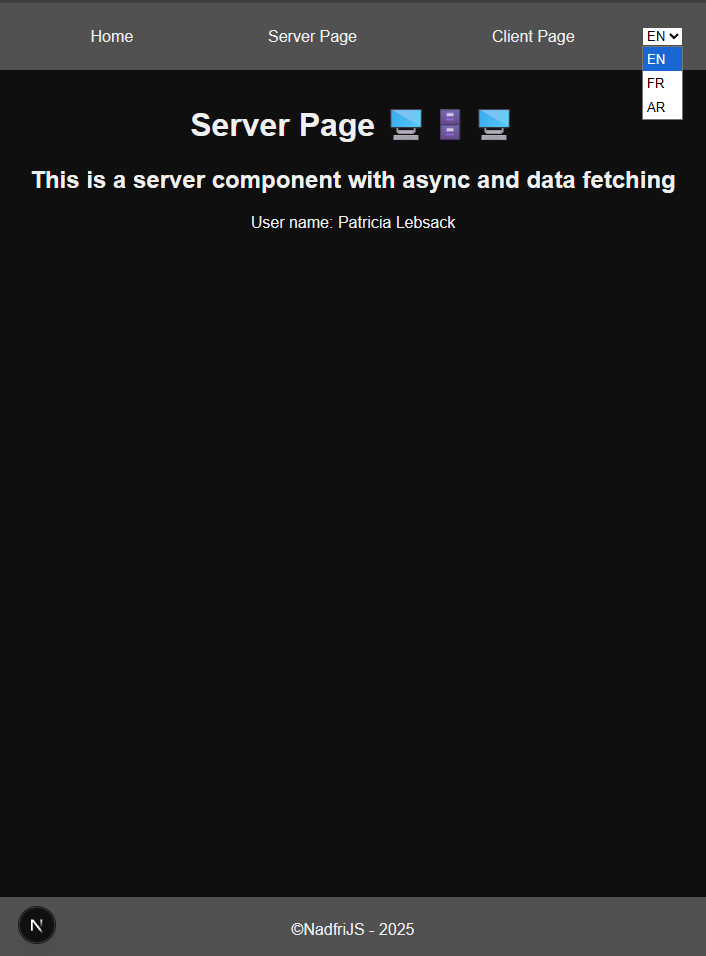

# 🌐 Next.js 15 + next-intl - Internationalization Tutorial

This project is a complete example of internationalization implementation with **next-intl** in **Next.js 15**. It's part of a YouTube tutorial explaining how to configure and use next-intl to create multilingual applications.

## 📋 Project Overview

This repository contains two main branches:

- `without-next-intl`: The base project without internationalization (starting point)
- `main`: The final project with next-intl configured and functional

The project supports 3 languages:

- 🇺🇸 English (en) - default language
- 🇫🇷 French (fr)
- 🇸🇦 Arabic (ar) - with RTL support

## 🖼️ Preview



## 🚀 Quick Start

### Prerequisites

- Node.js 18+
- pnpm (recommended) or npm/yarn

### Installation

1. **Clone the project**

```bash
git clone https://github.com/nadfri/nextjs-intl-i18n.git
cd nextjs-intl-i18n
```

2. **Install dependencies**

```bash
pnpm install
# or
npm install
```

3. **Start the development server**

```bash
pnpm dev
# or
npm run dev
```

4. **Open the application**
   - Open [http://localhost:3000](http://localhost:3000)
   - The application will automatically detect your browser's language
   - You can also access directly:
     - [http://localhost:3000/en](http://localhost:3000/en) (English)
     - [http://localhost:3000/fr](http://localhost:3000/fr) (French)
     - [http://localhost:3000/ar](http://localhost:3000/ar) (Arabic)

## 🔧 Recommended Extension

For a better development experience with translations, install the **i18n Ally** extension:

- **VS Code**: [i18n Ally](https://marketplace.visualstudio.com/items?itemName=Lokalise.i18n-ally)
- **Features**:
  - Real-time translation visualization
  - Translation key auto-completion
  - Missing translation detection
  - Inline translation editor

## 📁 Project Structure

```
src/
├── app/
│   └── [locale]/           # Routes with locale parameter
│       ├── layout.tsx      # Main layout with NextIntlClientProvider
│       ├── page.tsx        # Homepage
│       ├── client-page/    # Client page example
│       └── server-page/    # Server page example
├── components/
│   ├── Header.tsx          # Navigation with translated links
│   ├── Footer.tsx          # Footer
│   └── ToggleLocale.tsx    # Language selector
├── i18n/
│   ├── routing.ts          # Routes and locales configuration
│   ├── navigation.ts       # Typed navigation with next-intl
│   └── request.ts          # Requests and messages configuration
└── messages/
    ├── en.json             # English translations
    ├── fr.json             # French translations
    └── ar.json             # Arabic translations
```

## ⚙️ next-intl Configuration

### 1. Next.js Configuration (`next.config.ts`)

```typescript
import createNextIntlPlugin from 'next-intl/plugin';

const withNextIntl = createNextIntlPlugin();
export default withNextIntl({});
```

### 2. Middleware (`src/middleware.ts`)

```typescript
import createMiddleware from 'next-intl/middleware';
import { routing } from './i18n/routing';

export default createMiddleware(routing);

export const config = {
  matcher: '/((?!api|trpc|_next|_vercel|.*\\..*).*)',
};
```

### 3. Routes Configuration (`src/i18n/routing.ts`)

```typescript
import { defineRouting } from 'next-intl/routing';

export const routing = defineRouting({
  locales: ['en', 'fr', 'ar'],
  defaultLocale: 'en',
  localeDetection: true,
});
```

### 4. Request Configuration (`src/i18n/request.ts`)

```typescript
import { getRequestConfig } from 'next-intl/server';
import { hasLocale } from 'next-intl';
import { routing } from './routing';

export default getRequestConfig(async ({ requestLocale }) => {
  const requested = await requestLocale;
  const locale = hasLocale(routing.locales, requested)
    ? requested
    : routing.defaultLocale;

  return {
    locale,
    messages: (await import(`../messages/${locale}.json`)).default,
  };
});
```

### 5. Typed Navigation (`src/i18n/navigation.ts`)

Expose typed navigation helpers scoped to your routing config. This ensures locale-aware links and router operations:

```typescript
import { createNavigation } from 'next-intl/navigation';
import { routing } from './routing';

export const { Link, redirect, usePathname, useRouter, getPathname } =
  createNavigation(routing);
```

Usage:

- Use `Link` instead of `next/link` to automatically prefix locales and get key-safety.
- Use `useRouter` and `redirect` from here to remain locale-aware.

### 6. Global Type-Safety (`global.ts`)

Augment next-intl types to provide proper autocomplete for `Locale` and `Messages` across your app:

```ts
import { routing } from '@/i18n/routing';
import messages from '@/messages/en.json';

declare module 'next-intl' {
  interface AppConfig {
    Locale: (typeof routing.locales)[number];
    Messages: typeof messages;
  }
}
```

This enables strong typing for hooks like `useTranslations` and `useLocale`.

### 7. Client Locale Toggle (`src/components/ToggleLocale.tsx`)

Client-side language switcher that preserves the current path and query params while switching locales:

```tsx
'use client';
import { useRouter, usePathname } from '@/i18n/navigation';
import { routing } from '@/i18n/routing';
import { Locale, useLocale } from 'next-intl';
import { useSearchParams } from 'next/navigation';
import { Suspense } from 'react';

function ToggleLocale() {
  const router = useRouter();
  const pathname = usePathname();
  const searchParams = useSearchParams();
  const locales = routing.locales;
  const currentLocale = useLocale();

  const handleLocaleChange = (event: React.ChangeEvent<HTMLSelectElement>) => {
    const selectedLocale = event.target.value as Locale;
    const queryString = searchParams.toString();
    const newUrl = queryString ? `${pathname}?${queryString}` : pathname;

    router.replace({ pathname: newUrl }, { locale: selectedLocale });
    // router.refresh(); // Optional: Refresh the page to load locale-specific data
  };

  return (
    <select onChange={handleLocaleChange} value={currentLocale}>
      {locales.map((locale) => (
        <option key={locale} value={locale}>
          {locale.toUpperCase()}
        </option>
      ))}
    </select>
  );
}

// Wrapper component to enable Suspense due to useSearchParams
export function ToggleLocalSuspense() {
  return (
    <Suspense fallback='Loading...'>
      <ToggleLocale />
    </Suspense>
  );
}
```

Place `ToggleLocalSuspense` in your header to allow users to switch locales anywhere.

## 💡 Implemented Features

### ✅ Automatic Language Detection

- Based on browser preferences
- Fallback to default language

### ✅ Internationalized Routing

- URLs with language prefixes: `/en/about`, `/fr/about`
- Typed navigation with next-intl `Link`

### ✅ Language Selector

- Client component to change language
- URL preservation when switching languages

### ✅ Server and Client Components Support

- `useTranslations` for client components
- `getTranslations` for server components

### ✅ Localized Formatting

- Dates and times adapted to each locale
- RTL formatting support for Arabic

### ✅ 404 Error Handling

- Translated 404 page per locale

## 🎯 Available Scripts

- `pnpm dev`: Starts the development server with Turbopack
- `pnpm build`: Production build with Turbopack
- `pnpm start`: Starts the production server
- `pnpm lint`: ESLint verification

## 📚 Useful Resources

- [next-intl Documentation](https://next-intl-docs.vercel.app/)
- [Next.js 15 Documentation](https://nextjs.org/docs)
- [i18n Ally Extension](https://github.com/lokalise/i18n-ally)

## 🎥 YouTube Tutorial

This project accompanies a detailed YouTube tutorial explaining:

1. How to start from the base project (`without-next-intl`)
2. Installation and configuration of next-intl
3. Creating translation files
4. Implementation in components
5. Routing and navigation management
6. Best practices and optimizations

---

**Created by [nadfri](https://github.com/nadfri)** for the YouTube tutorial on internationalization with Next.js 15 and next-intl.
